# 📚 GyaanGanga

GyaanGanga is a .NET-based online book platform where users can browse books, manage cart, place orders, and interact with content, while admins manage books, orders, and announcements.

---

## 🛠️ Tech Stack
- .NET (MAUI)  
- C#  
- PostgreSQL 

---

## 🚀 Features

### 👤 User
- Browse books  
- Add to cart & checkout  
- Bookmark books  
- View purchase history  
- Submit reviews  

### 🛠️ Admin
- Manage books  
- Manage orders  
- Add announcements  
- View reports  

---

## ⚙️ How It Works
1. User browses books  
2. Adds items to cart  
3. Places order  
4. Views history / submits review  
5. Admin manages system from dashboard  

---

## 📱 Screenshots

### 🏠 Home
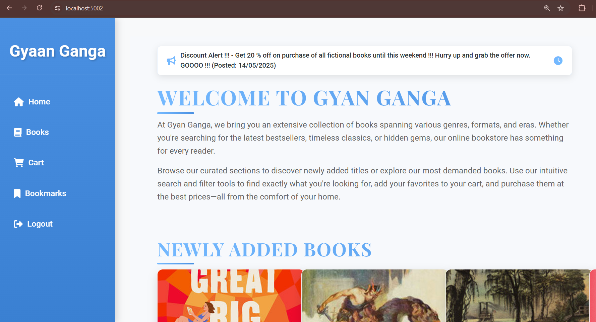

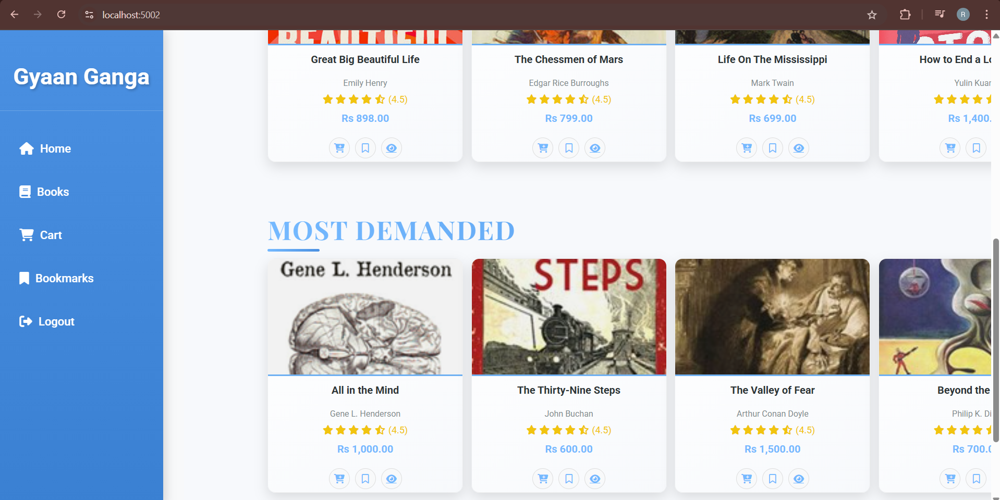

---

### 📚 Books
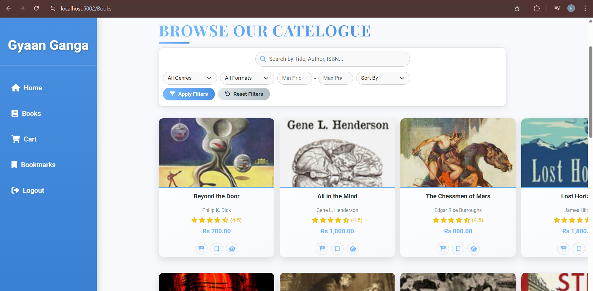

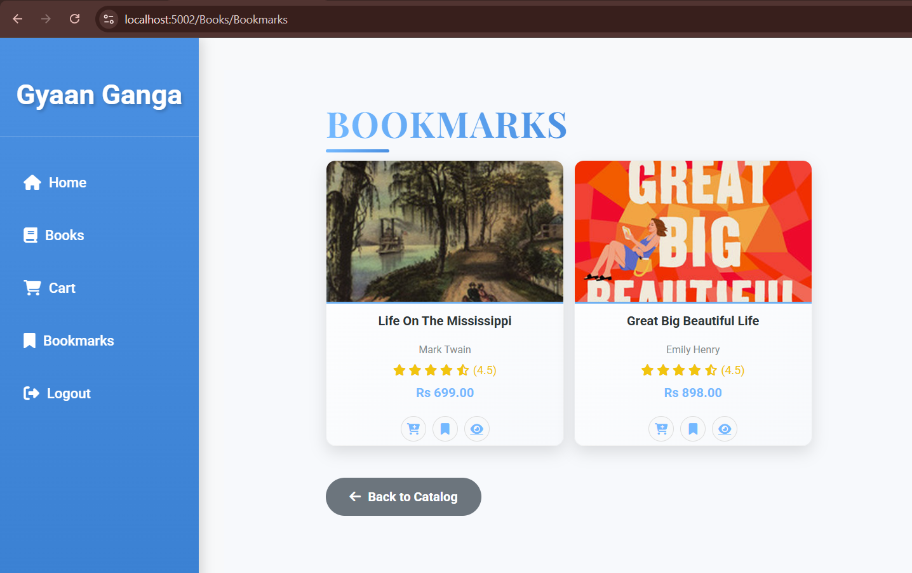

---

### 🛒 Cart & Orders
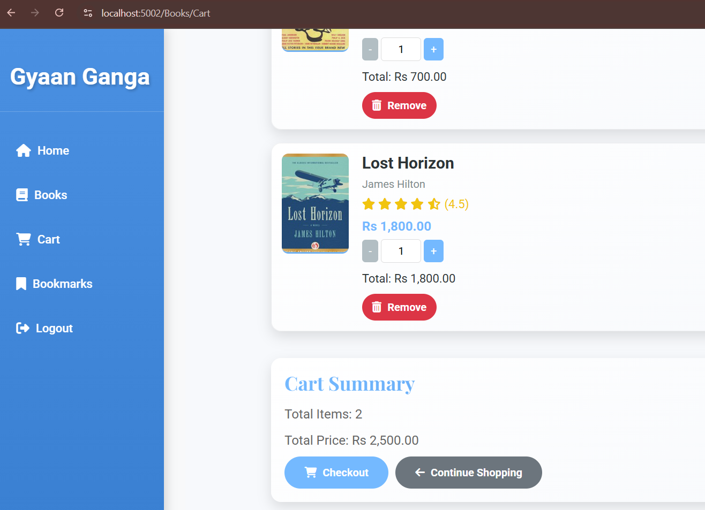

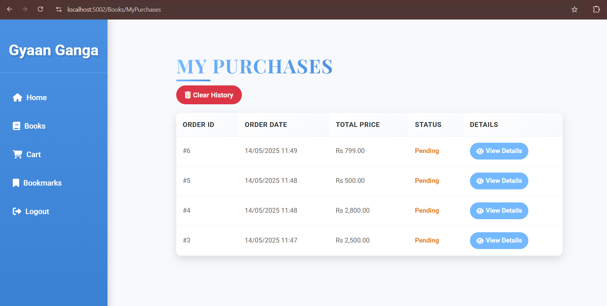

---

### ⭐ Reviews
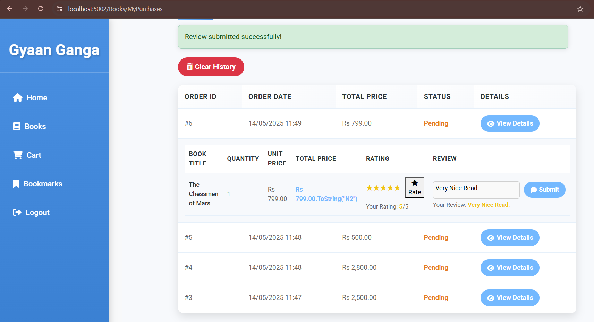

---

### 🛠️ Admin Panel
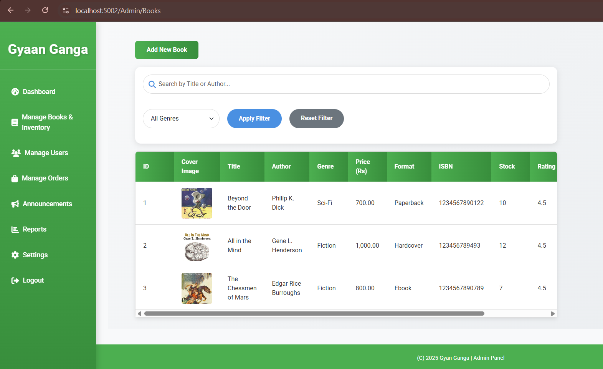

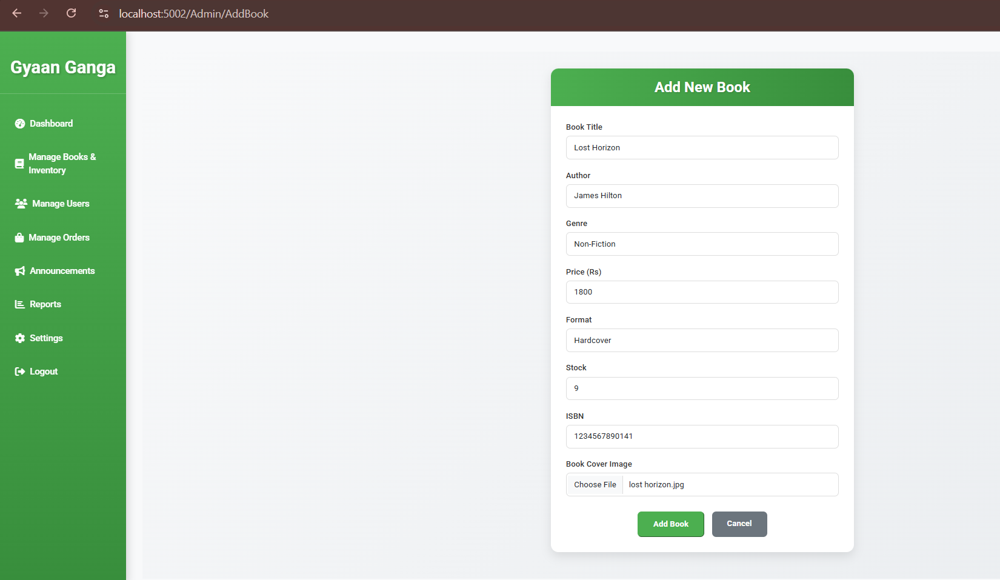

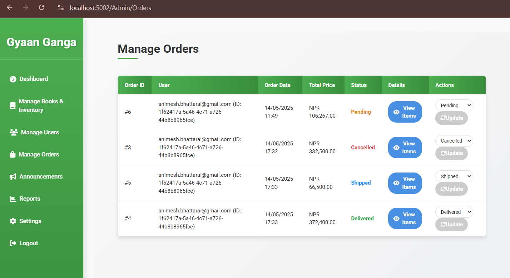

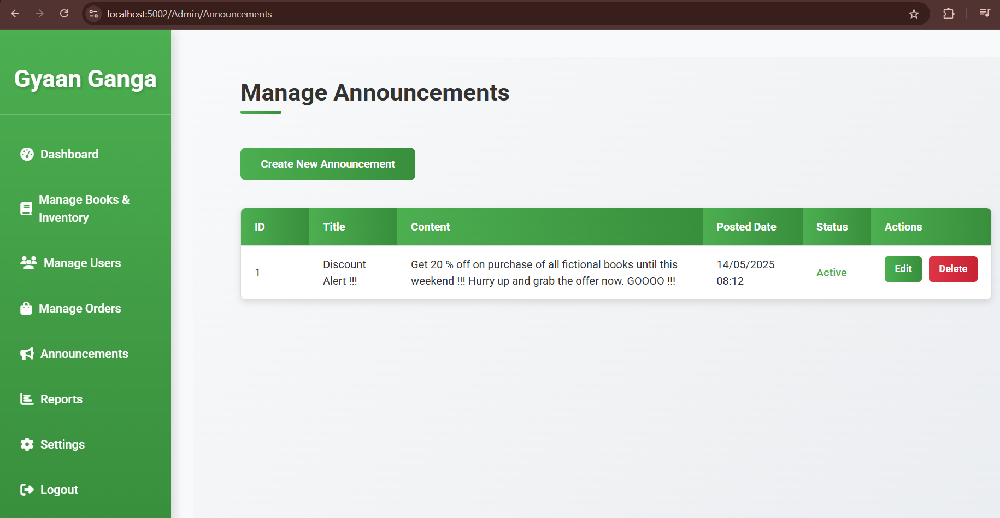

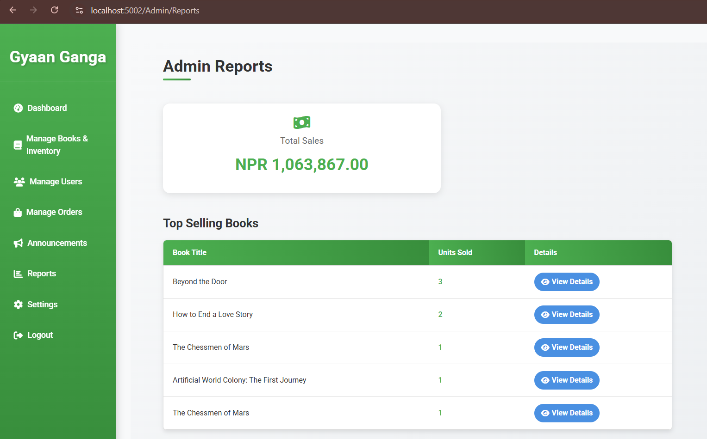

---

## 💡 Purpose
To provide a simple and efficient platform for managing and purchasing books with both user and admin functionalities.
